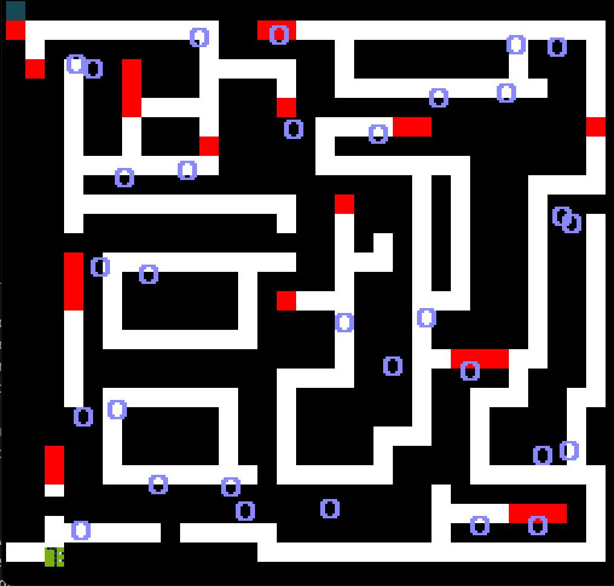

# Walko's Adventure

Author: Denise Yang

Design: A maze solving game that involves 

Screen Shot:

How Your Asset Pipeline Works:

I created a color palette png, a tiles png, a sprite tile png, a maze png using https://www.piskelapp.com/p/create/sprite and used a python script to process them as string values in a text file. 
My palette png was 8x1 so I could store each color in a palette.txt that I then loaded into the ppu.palette_table. Each of my sprite/map tiles were 8x8 so I would calculate their color by checking if it matched with one of the colors that was already loaded in the python script and if so I would return the 1st and 2nd bit of h

(TODO: make sure the source files you drew are included. You can [link](your/file.png) to them to be a bit fancier.)

How To Play:

Meet Walko! He loves to walk, but unfortunately he's walked so much that now he's lost in a maze. Luckily he has you a mysterious being that has the power to fill in the missing paths. Let's go on an adventure with Walko! (btw Walko hate's the color red, like he and his world will literally cease to exist. Just don't touch red and help him find his green!

You can use the arrow keys to move a box around and press SPACEBAR to turn yourself into a white path that Walko can walk on. Be careful not to let Walko run into the red tiles or else everything will crash. Try to make it to the green tile in the top left corner. 

This game was built with [NEST](NEST.md).

